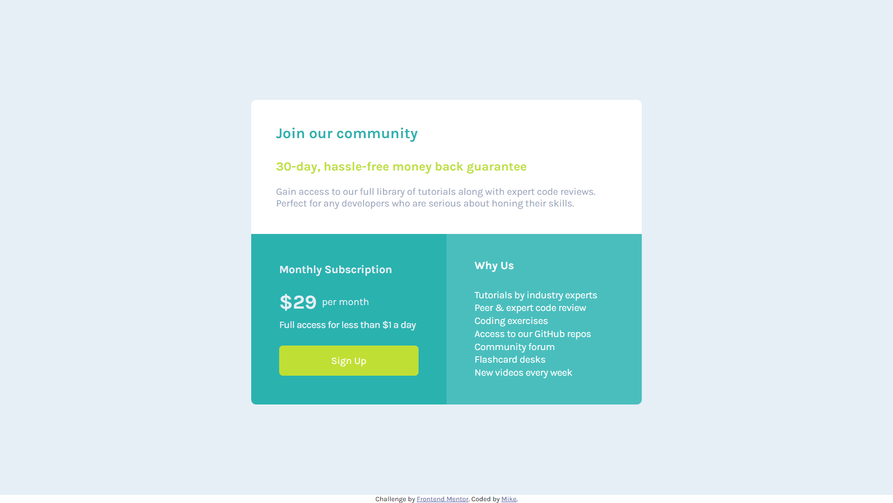

# Frontend Mentor - Single price grid component solution

This is a solution to the [Single price grid component challenge on Frontend Mentor](https://www.frontendmentor.io/challenges/single-price-grid-component-5ce41129d0ff452fec5abbbc). Frontend Mentor challenges help you improve your coding skills by building realistic projects. 

## Table of contents

- [Overview](#overview)
  - [The challenge](#the-challenge)
  - [Screenshot](#screenshot)
  - [Links](#links)
- [My process](#my-process)
  - [Built with](#built-with)
  - [What I learned](#what-i-learned)
  - [Continued development](#continued-development)
- [Author](#author)
- [Acknowledgments](#acknowledgments

## Overview
A responsive single-price component with HTML and CSS. A thoughtful blend of structural design and styling to ensure a seamless user experience across various devices
In the HTML structure, semantic tags was used to encapsulate the pricing information, making it accessible and easily understandable. In the CSS styling, the focuses was on a clean and modern design, employing techniques such as Flexbox and Grid for layout and media queries for responsiveness

### The challenge

Users should be able to:

- View the optimal layout for the component depending on their device's screen size
- See a hover state on desktop for the Sign Up call-to-action

### Screenshot

### Links

- Solution URL: [My solution URL](https://github.com/sanyomor-01/single-price-grid-component-master)
- Live Site URL: [The live site URL ](https://single-price-grid-component-master-sigma-murex.vercel.app/)

## My process
- Redesigned the component in figma basing the image of how final work should look like. The helped accurate lengths.

- HTML structure , created the basic HTML structure for the component. Included essential meta tags for viewport settings to ensure proper rendering on various devices

- CSS Sttyling. 
        Created a separate CSS file (styles.css) to define the appearance of the price component.

        Used styling properties to set the maximum width, margin, padding, border-radius, and box-shadow for the component container.

        Implemented CSS Flexbox or Grid for layout and positioning.

        Employed media queries to introduce responsive design, adjusting styles based on different screen widths.

 

### Built with

- Semantic HTML5 markup
- CSS custom properties
- Flexbox
- CSS Grid
- Mobile-first workflow
### What I learned

Improve upon the knowlegde and use of media queries as used in the styling process

### Continued development
- An overlay sign up form when the button is click
- A JS code to handle data from the form

## Author

- Linkedin - [Michael Sanyomor](https://www.linkedin.com/in/michael-sanyomor/)
- Frontend Mentor - [@sanyomor-01](https://www.frontendmentor.io/profile/sanyomor-01)
- Twitter - [@sanyo_mor](https://twitter.com/sanyo_mor)

## Acknowledgments

A hat tip to me for working on this 🚀project with love.
